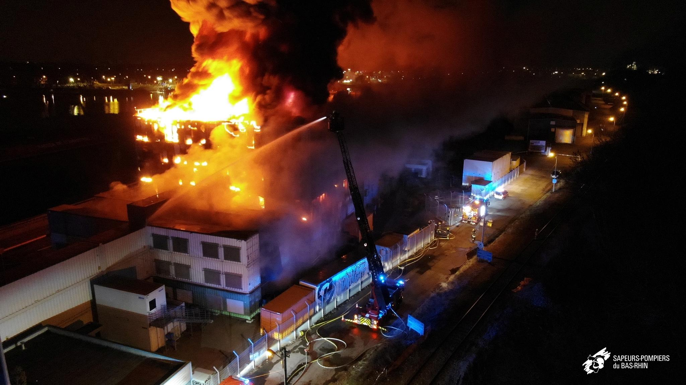

# Intro

## Woensdag 10 maart 2021, 01:31

[Inuits](https://inuits.eu/) on-call team merkt dat enkele VMs "weg" zijn.

## Dit zijn productiesystemen!

## Het lijkt er op dat ze niet terugkomen...

## Woensdag 10 maart 2021, 03:42

<center><blockquote class="twitter-tweet"><p lang="en" dir="ltr">We have a major incident on SBG2. The fire declared in the building. Firefighters were immediately on the scene but could not control the fire in SBG2. The whole site has been isolated which impacts all services in SGB1-4. We recommend to activate your Disaster Recovery Plan.</p>&mdash; Octave Klaba (@olesovhcom) <a href="https://twitter.com/olesovhcom/status/1369478732247932929?ref_src=twsrc%5Etfw">March 10, 2021</a></blockquote><script async src="https://platform.twitter.com/widgets.js" charset="utf-8"></script></center>

## De situatie

- [OVHcloud](https://www.ovhcloud.com/nl/) is een cloudprovider
- 32 datacenters over 4 continenten
- o.a. in Straatsburg (SBG)

---



---


---


---


## Je servers zijn dus *weg*. Wat nu?


## Wat was er gebeurd?

- Waarschijnlijk een defecte UPS (stroomvoorziening)
- 3,6M websites, 464K domeinen weg
- Impact op bedrijven *en* overheden
- Geen disaster recovery plan? Vaarwel data! Vaarwel klanten! Vaarwel bedrijf!

## De situatie bij Inuits

- 130 VMs over 12 servers zijn weg
- Meeste problemen opgelost door automatische failover naar andere datacenters
- Enkele "probleemgevallen"...

## Casus 1

- VIP klant, failover faalt
- Handmatige wijziging DNS record nodig voor de load balancer
- 1u kwijt: klant had controle over DNS, moesten wijziging zelf doen

## Casus 2

- Klant verspreid over 2 DCs
- Volledige infrastructuur gereconstrueerd bij andere ISP **vóór 9:00**
- Zonder notificatie zou klant niets gemerkt hebben...

## Impact op Inuits

- **Geen dataverlies!**

- Meeste problemen opgelost voor aanvang kantooruren

## Wat is hun "geheim"?

- **Infrastructure as Code**
    - Configuration Management
    - Alles is een pipeline!
- Cloud native
    - Geen eigen HW
    - Multi-cloud, cloud-agnostic
- High Availability in het design

## Referenties

- Buytaert, K. (2020-06-17) [Help, my datacenter is on fire!](https://www.slideshare.net/KrisBuytaert/help-my-datacenter-is-on-fire). StackConf 2021. <https://youtu.be/zDfH0DpHT3s>
- Rosemain, M. & Satter, R. (2021-03-10) [Millions of websites offline after fire at French cloud services firm](https://www.reuters.com/article/us-france-ovh-fire-idUSKBN2B20NU). Reuters
- Witteman, E. (2021-03-15) [OVH fire may be caused by faulty UPS](https://www.techzine.eu/news/infrastructure/56935/ovh-fire-may-be-caused-by-faulty-ups/)

# Infrastructure Automation

## Infrastructure Automation

Gerelateerde termen:

- Infrastructure as Code
- GitOps
- DevOps

## Levenscyclus van een server

Wat zijn de verschillende fasen in het leven van een server(-VM)?

## Tooling (1/3)

Tools voor server lifecycle management:

- **Provisioning:** lege machine → JEOS
    - Vagrant, Packer, Docker, Terraform/OpenTofu, Pulumi, ...
- **Configuration Management:** JEOS → klaar voor productie
    - Ansible, Puppet, Chef, CFEngine, ...

## Tooling (2/3)

- **Software Delivery**/Release engineering
    - CI/CD: Jenkins, Travis CI, Circle CI, Gitlab CI, Github Actions, ...
    - Packaging: rpmbuild, dpkg-deb, fpm
    - Package mgmt: RPM, deb, npm, RubyGems, pip, Helm, Chocolatey, WinGet, ...
    - Repository management: Pulp

## Tooling (3/3)

- **Orchestration:** systemen in productie beheren
    - Ansible, SaltStack, Kubernetes, ...
- **Monitoring:**
    - Traditioneel: Icinga, Nagios, ...
    - Time Series DB: Prometheus, collectd, Cacti, ...
    - Logging: Grafana Loki, Elastic stack, Splunk, Fluentd, ...

# Studiewijzer

## Studiewijzer

Zie Chamilo-cursus voor gedetailleerde info!

---


## Leerdoelen en competenties

- **Provisioning**: Vagrant
- **Configuration Management Systems**: Ansible
- **Software delivery**: CI/CD met Jenkins
- **Orchestration**: Kubernetes
- **Monitoring**: Prometheus

## Cursusinhoud

- Intro, werkomgeving opzetten
- M1. Continuous Integration/Delivery
- M2. Configuration management
- M3. Container orchestration
- M4. Monitoring

## Leermaterialen

- Start met het overzicht in de Chamilo-cursus
- Github: [slides lessen](https://hogenttin.github.io/infra-slides/), [demo-omgeving](https://github.com/HoGentTIN/infra-demo), [labo-opdrachten](https://github.com/HoGentTIN/infra-labs)
- Leerpad met links naar
    - Online handleidingen van gebruikte software
    - (e-)Boeken
    - Online cursussen
- Basiskennis Linux herhalen: [linux-training-hogent](https://hogenttin.github.io/linux-training-hogent/)

## Nodige software

```console
PS> winget install Git.Git
PS> winget install Microsoft.VisualStudioCode
PS> winget install Oracle.Virtualbox --version 7.0.20
PS> winget install Hashicorp.Vagrant
```

(Mac, Linux: zie studiegids op Chamilo)

## Software (vervolg)

- VSCode: installeer aangeraden plugins (zie studiegids)
- VirtualBox:
    - Installeer niet 7.1!
    - Extension Pack!
- Git client: ook Git Bash installeren!

## Werkvormen

- Klassikale instructie en demonstraties
- Labo-opdrachten

## Studiebegeleiding

- Individuele begeleiding voor labo-opdrachten
- Stel vragen *tijdens de les*
- Buiten de les: *algemeen Teams-kanaal*
- Enkel voor persoonlijke vragen: *e-mail/Teams chat*

## Evaluatie

- **Beoordeling via rubrics**
    - Voor elke opdracht minstens "bekwaam" halen
- **Portfolio**:
    - Github repo met broncode en laboverslagen
- **Demo's**:
    - Tijdens het semester:
        - M1, M3 vóór de deadline!
        - On-campus of via Panopto-opname
        - M2, M4 *optioneel* voor W12 of via Panopto voor 18/12
    - Examenperiode:
        - M2, M4 via Teams

## Tweede examenkans

Persoonlijke opdracht, geen begeleiding

- Niet afgewerkte labo-opdrachten
- Extra opdrachten (TBD), mogelijke topics:
    - Packer, OpenTofu
    - Cilium, Helm, Chaos Engineering
    - Gitlab CI
    - Grafana Loki
    - Bijdrage open source project

## Semesterplanning

1. intro, installatie software

    M1. Continuous Integration/Delivery with Jenkins

2. (labos)

3. M2. Configuration management with Ansible

4. (labos)

5. (labos) **Deadline M1.**

6. (labos)

## Semester schedule

7. M3. Container Orchestration with Kubernetes

8. (labos)

9. (labos)

10. M4. Monitoring

11. (labos)

12. (labos) **Deadline M3.**

13. Optioneel: inhaalsessie

    Wo 18 dec: **Deadline Panopto-opnames (M2, M4)**

## Vragen?

- Stel vragen tijdens de contactmomenten
- Gebruik het Teams-kanaal
