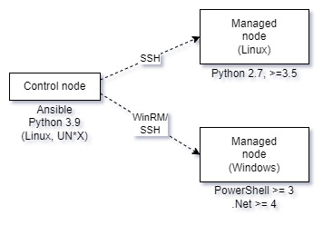
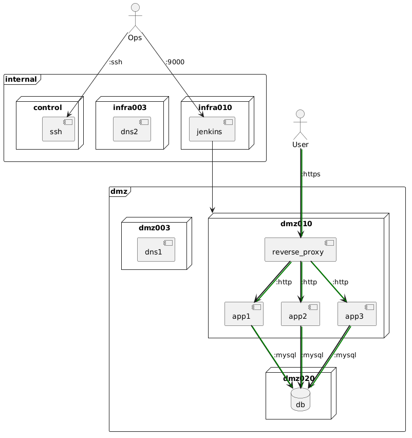

# Configuration management

## Learning goals

- Understanding the concept of cfg mgmt systems
    - declarative, idempotent
    - advantages over scripting
- Setting up network services with Ansible
    - applying basic concepts: playbooks, variables, modules, roles
    - writing playbooks
    - using existing roles

## What's wrong with scripting?

```bash
dnf install -y httpd
systemctl enable --now httpd
firewall-cmd --add-service http --permanent
firewall-cmd --add-service https --permanent
firewall-cmd --reload
```

## Adding a user

```bash
adduser admin
```

Run this script twice:

```console
$ sudo ./setup-server.sh
$ sudo ./setup-server.sh
useradd: user 'admin' already exists
```

## What about...

- small changes between hosts?
- maintaining config files?
- maintaining a large Bash code base?
- configuration drift?

## Bash doesn't scale!

## Enter configuration management

- 1993: CFEngine by Mark Burgess
- Declarative
- Idempotent

## Declarative

- Describe the desired state of the system
    - DSL, existing language
- Cfg mgmt system brings system to desired state
    - independent of initial state
    - in one pass
    - abort on fail

## Example: CFEngine DSL

Domain Specific Language (DSL)

```cfengine
body common control {
    bundlesequence => { "install_packages" };
    inputs => { "libraries/cfengine_stdlib.cf" };
}

bundle agent install_packages {
    vars:
        "desired_packages"
            slist => { "httpd", "mod_ssl" };
    packages:
        "$(desired_packages)"
            package_policy => "add",
            package_method => generic;
}
```

## Example: Puppet manifest (DSL)

```puppet
package { 'httpd':
  ensure => installed,
}

service { 'httpd':
  ensure => running,
}
```

## Example: Chef recipe (Ruby)

```ruby
packages = ["httpd", "mod_ssl"]

packages.each do |pkg|
  package pkg do
    action: install
  end
end

service "httpd" do
  action [:start, :enable]
end
```

## Example: Ansible playbook (YAML)

```yaml
- hosts: srv001
  vars:
    packages:
      - httpd
      - mod_ssl
  tasks:
    - name: Ensure packages are installed
      package:
        name: "{{ packages }}"
        state: installed
    - name: Ensure the service is running
      service:
        name: httpd
        state: started
        enabled: true
```

## Idempotence

- Single pass
- End state is guaranteed
    - or run aborted!
- Only necessary changes

## Advantages

- Easier to reuse
- Readable
- Scaleable
- Config file templates
- Manage configuration drift
- Cfg mgmt = disaster recovery plan!

## Recommendation

- Manage your entire infrastructure using a config management system
- Use revision control system!
- Never make manual changes to a production system!

# Ansible demo

## Ansible control/managed nodes



## Lab assignment setup



## `labenv` environment

```console
> cd infra-labs-26-27-USERNAME/labenv
> vagrant up control
> vagrant ssh control
> cd /vagrant/ansible
```

## Add a new VM

In `vagrant-hosts.yml` (*before* the control node!):

```yaml
- name: dmz020
  box: bento/debian-13
  ip: 192.0.2.20
```

and run `vagrant up dmz020`

## The inventory file

```yaml
# ... lines omitted ...
  children:
    infra_hosts:
      hosts:
        infra010:
          ansible_host: 172.16.0.10
    dmz_hosts:
      hosts:
        dmz020:
          ansible_host: 192.0.2.20
```

## Connecting to managed hosts

Try this:

```console
> ansible -i inventory.yml dmz020 -m ping
> ansible -i inventory.yml dmz020 -m setup
```

## Main playbook

```yaml
# ansible/site.yml
---

- name: "Configure dmz020"  # Each task should have a name
  hosts: dmz020             # Indicates hosts this applies to (host or group name)
  tasks:                    # Enumerate tasks to be executed on the target system
    - name: "Show a message from the managed node"
      ansible.builtin.debug:
        msg: "Hello from {{ ansible_facts.hostname }}!"
```

Let's try out the example playbook!

## Running a playbook

```console
[vagrant@control ansible]$ ansible-playbook -i inventory.yml site.yml 

PLAY [Configure dmz020] *******************************************************************************

TASK [Gathering Facts] *******************************************************************************
ok: [dmz020]

TASK [Ansible demo] *******************************************************************************
ok: [srdmz020v100] => {
    "msg": "Hello from host dmz020!"
}

PLAY RECAP *******************************************************************************
dmz020                     : ok=2    changed=0    unreachable=0    failed=0    skipped=0    rescued=0    ignored=0   

```

## Installing a role

```console
> ansible-galaxy install fauust.mariadb
```

Add a section `roles:` to `site.yml`:

```yaml
# site.yml
---
- name: "Configure dmz020"
  hosts: dmz020
  roles:
    - fauust.mariadb
  tasks:
    - name: "Show a message from the managed node"
      ansible.builtin.debug:
        msg: "Hello from {{ ansible_facts.hostname }}!"
```

and run the playbook again.

## Play it again, Sam!

After the first run:

```console
PLAY RECAP *******************************************************************************
dmz020                     : ok=33   changed=13   unreachable=0    failed=0    skipped=19   rescued=0    ignored=0   
```

After the second one:

```console
PLAY RECAP *******************************************************************************
dmz020                     : ok=31   changed=0    unreachable=0    failed=0    skipped=19   rescued=0    ignored=0   
```

Idempotency at work!

## Roles: reusable playbooks

- <https://galaxy.ansible.com/>
- e.g., the fauust.mariadb role:
    - Galaxy page: <https://galaxy.ansible.com/ui/standalone/roles/fauust/mariadb/>
    - Github: <https://github.com/fauust/ansible-role-mariadb>

Role behaviour can be changed by setting (role) variables. See the README!

## Initialising variables

- In the playbook
- `host_vars/dmz020.yml`
- `group_vars/servers.yml`
- `group_vars/all.yml`
- ...

```yaml
# ansible/host_vars/dmz020.yml
---
# should listen to all interfaces, not just localhost
mariadb_bind_address: 

# A database for each web application that needs it
mariadb_databases:
# Check the documentation to see how to create two databases!

# A user for each database, with a strong password and restricted to log in
# from the web server
mariadb_users:
# Check the documentation to see how to create users!
```

## That's enough for now!

## Resources

- [Ansible documentation](https://docs.ansible.com/ansible/latest/user_guide/)
- [Ansible directory layout](https://docs.ansible.com/ansible/latest/user_guide/sample_setup.html)
- Recommended books:
    - Geerling, J. (2020) [*Ansible for Devops*](https://leanpub.com/ansible-for-devops)
    - Sesto, V. (2021) [*Practical Ansible*](https://link.springer.com/book/10.1007%2F978-1-4842-6485-0)

## Time to get started!

- Continue with the lab assignment
