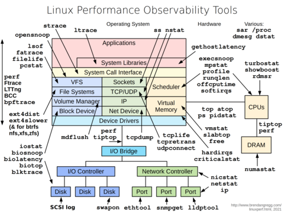
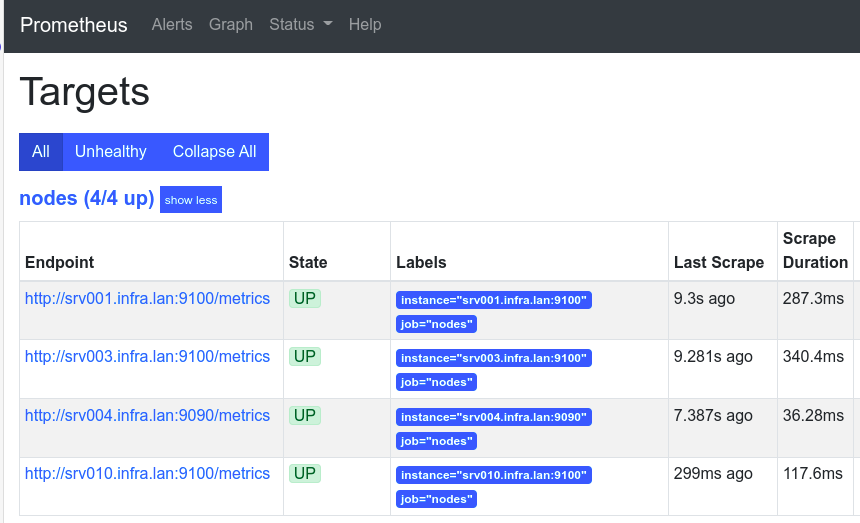
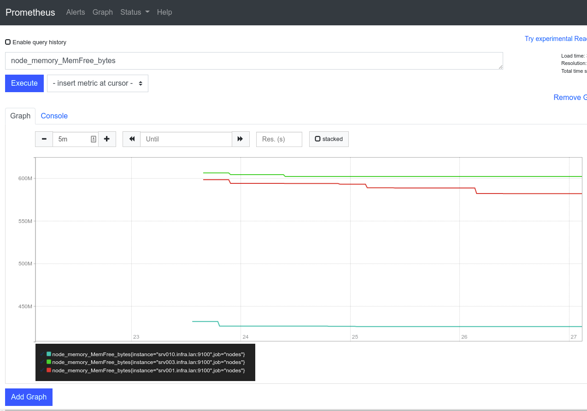

# Monitoring

## Learning goals

- Understanding the concept of monitoring, observability
- Setting up a monitoring dashboard with Prometheus

## What is monitoring?

Keep track of systems running in production

- Problem detection
- Troubleshooting
- Reporting and improvement

Part of *Reliability Engineering*

## What to monitor?

Anything that matters for your business! -> **monitoring targets**

- Demand
- Workload
    - Availability, performance, faults/errors
- Resources (technical metrics)
    - e.g. CPU, connection pool capacity, ...
- Business metrics

## Early monitoring solutions: Alerting

- Nagios, Icinga, Zmon, Sensu, ...
- Regularly execute checks (scripts)
- Nonzero exit status? Generate alert!


## Early monitoring solutions: Graphing

- E.g. Graphite, mrtg
- Backed by time series database filled with metrics
- Separate tool for data collection (e.g. collectd, statsd)


## #monitoringsucks

- Trending in 2011
- Cloud (r)evolution
    - Scaling up, automation
    - Servers as pets -> servers as cattle
- Many tools, not suited for new needs
    - Not scalable
    - Manual approach to system administration
    - Too many alerts

## Characteristics

- Graphing/alerting are separate
- Manual approach to system administration
- No specific tools for log mgmt (tail, grep, awk!)

## Monitoring in a DevOps world

- Integrated
    - metrics, logging, alerting, visualisation
- Self service
    - Service discovery
- Dynamic
    - New nodes, destroyed nodes, ...
- Collaborative
    - Shared between all disciplines within the team
- Observable applications
    - Applications provide their own instrumentation
    - Devs should implement this!

## Types of monitoring

- Synthetic monitoring
- End user (experience) monitoring
- System monitoring
- Network monitoring
- Software metrics
- Application monitoring
- Log monitoring

## Synthetic monitoring

- = generate traffic that simulates user interaction
- Is the application available for users?
- Simulate interactions programmatically
- Generates extra load!

## Simple synthetic monitoring

```console
$ time curl -I -s https://hogent.be/
HTTP/2 200 
date: Fri, 28 Oct 2022 10:54:36 GMT
content-type: text/html;charset=UTF-8
vary: Accept-Encoding
...

real    0m0,235s
user    0m0,097s
sys     0m0,019s
```

## End user monitoring

- = gather data from real end user activity
    - Response times
    - Error rates
    - Number of user interactions
    - User metadata (device type, OS version, geolocation, ...)
- More variation in interactions
- No extra load

## System monitoring

- This is what we are most familiar with!
- CPU, Memory, Disk I/O, Network I/O, ...
- Per process/per container/per VM metrics
- Kernel metrics, syscalls, ...

System monitoring does not show whether your application is available to users!

## System monitoring tools



Source: Gregg, B. (2021) *Linux Performance.* <https://www.brendangregg.com/linuxperf.html>

## Network monitoring

- Simple Network Management Protocol (SNMP)
    - Implemented in most network devices!
- Key metrics:
    - bandwith utilization
    - packet processing rates
    - latency
    - interface error rates
- Should be observed for every device on routing path of service

## Software metrics

- Some 3rd party applications already expose performance metrics
- Not standardized, different for each application
- Usually, plugins exist to integrate in your monitoring solution

## Application Monitoring

i.e. the application that your customers use and that your business generates income from!

- Often blind spot!
- Application problems:
    - App logic flaws
    - Capacity constraints
    - Dependency failures
- Measuring app health:
    - Transaction throughput (e.g. #completed reqs/s)
    - Response times
    - Error rates (e.g. HTTP 2xx, 4xx, 5xx)

## Log monitoring

- System and application logs
- Often best way to determine what went wrong and to find how to fix it
- Application logs only work if devs have the app generate logs!
- Has its own set of specialised tooling (e.g. ELK stack, Splunk, Grafana Loki, ...)

---

> I find that putting [devs] on call and making them figure out what's going on in their application from their own logs, is the absolute fastest way to improve their logging.
> 
> --Ernest Mueller (Director of Engineering, Six Nines IT)

## Putting it all together

- Enormous amount of metrics can be monitored
- Granularity also has impact
    - every 1s, 10s, 1m, ...?
- Determine what is most important for your situation
- Don't forget about application monitoring
    - Devs should make their apps observable!
- Share dashboards with application owners

# Prometheus

## Prometheus overview

<https://prometheus.io/>

- Open source systems monitoring & alerting
- Originally from SoundCloud
- Now part of Cloud Native Computing Foundation
    - Home of Kubernetes
- Collects and stores metrics as time series data
    - time stamp
    - key-value pairs called labels

## Features

- Time series collections via pull model over HTTP
- PromQL query language
- Service discovery or static configuration
- No reliance on distributed storage
- Multiple modes of graphing, dashboarding

## Components

- Prometheus server:
    - scrapes, stores TS data
- [Client libraries](https://prometheus.io/docs/instrumenting/clientlibs/):
    - for instrumenting application code
- [Exporters](https://prometheus.io/docs/instrumenting/exporters/)
    - for exposing metrics so Prometheus can scrape them
    - e.g. Node exporter for basic system metrics
    - also: MySQL, Kubernetes, SNMP, ...
- AlertManager
- ...

---



---



## Lab Assignment

- Install Prometheus collection for Ansible
    - Galaxy page: <https://galaxy.ansible.com/ui/repo/published/prometheus/prometheus/>
    - Docs: <https://prometheus-community.github.io/ansible/branch/main/>
- Install Node Exporter on all VMs
    - role `prometheus.prometheus.node_exporter`
- Install Prometheus on a new VM
    - srv004, 172.16.128.4
    - role `prometheus.prometheus.prometheus`
- Collect metrics
- Set up Grafana dashboard
